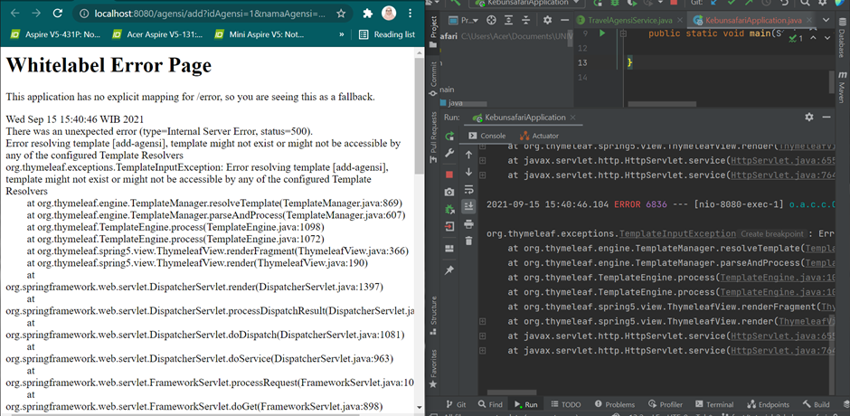
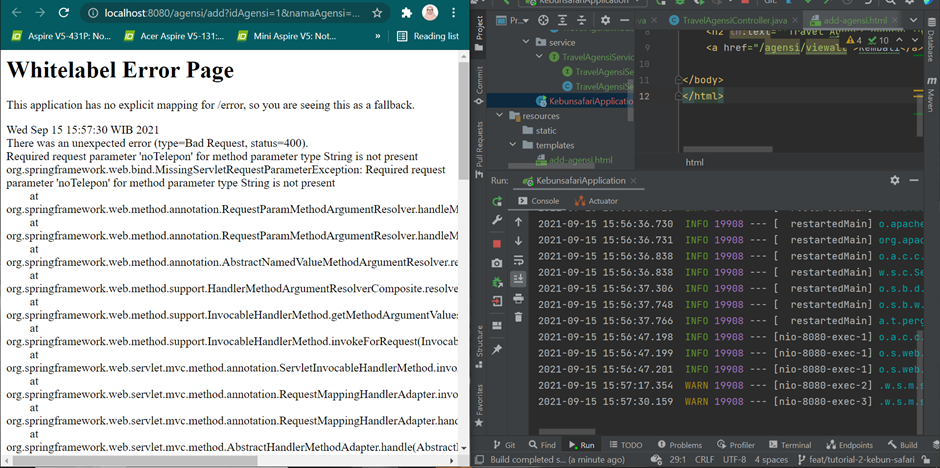
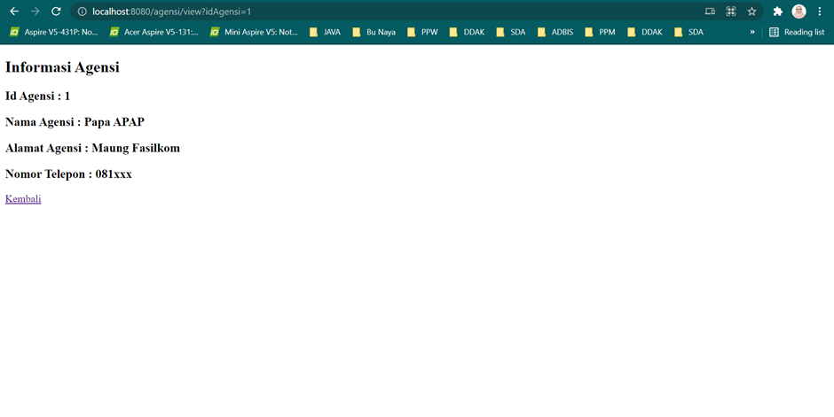
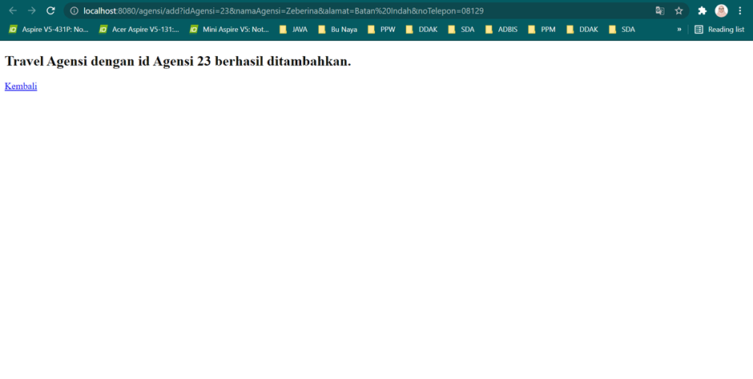
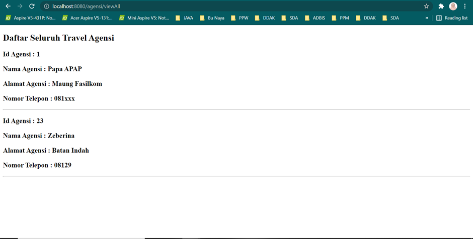
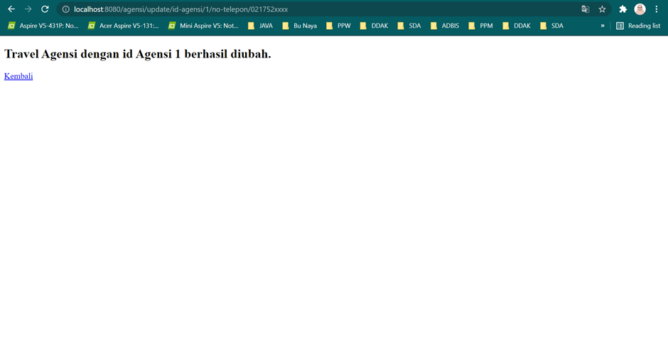
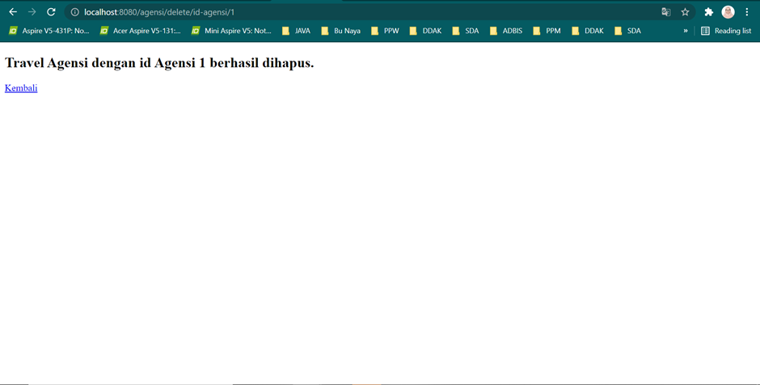

## Tutorial 4

### What I have learned today

- Saya belajar konsep view pada Spring Boot
- Saya belajar apa itu Thymeleaf dan kegunaannya

### Pertanyaan

1. Jelaskan perbedaan th:include dan th:replace!

th:include => memasukkan hanya konten dari fragmen yang ditentukan kepada atau sebagai bagian dari tagnya. Atribut th:include ini menyisipkan fragmen yang ditentukan sebagai badan tag inangnya tetapi tanpa menyisipkan fragment tag nya.

th:replace => mengganti (replace) tag inangnya nya dengan fragmen yang ditentukan atau didefinisikan pada tag inang tersebut. Atribut th:replace ini akan menggantikan tag host (inang) dengan fragmen tersebut. Hal tersebut berarti akan menghapus tag inang dan menggantikan tag inang dengan konten fragmen beserta fragment tag nya.

Sumber :

https://www.thymeleaf.org/doc/tutorials/3.0/usingthymeleaf.html

2. Jelaskan apa fungsi dari th:object!

Fungsi dari atribut th:object yaitu untuk menentukan objek yang terikat oleh data formulir yang dikirimkan. Masing-masing field dipetakan menggunakan atribut th:field=”*{nama}”, dimana ‘nama’ adalah properti objek yang sesuai dengan objek tersebut. Atribut th:object mendefinisikan objek mana yang dirujuk oleh _field_.

Sumber :

https://www.baeldung.com/thymeleaf-in-spring-mvc

https://stackabuse.com/getting-started-with-thymeleaf-in-java-and-spring/

3. Jelaskan perbedaan dari * dan $ pada saat penggunaan th:object! Kapan harus dipakai?

syntax $ => digunakan untuk menspesifikkan objek pada saat menggunakan atribut th:object. Syntax ${} pada atribut th:object dipakai ketika ingin memilih objek yang ingin digunakan.

syntax * => digunakan untuk menspesifikkan properti objek dari objek yang didefinisikan pada atribut th:object. Ketika suatu object telah didefinisikan pada atribut th:object dengan syntax ${}, maka kita dapat menggunakan syntax *{} untuk menspesifikkan properti dari objek tersebut. 

Sumber:

https://o7planning.org/12385/thymeleaf-th-object-and-asterisk-syntax

### What I did not understand

- [ ] Masih belum memahami syntax dari penggunaan Thymeleaf

(Anda dapat membuat tampilan code dalam README.md menjadi lebih baik. Cari tahu
lebih dalam tentang penulisan README.md di GitHub pada link
[berikut](https://help.github.com/en/articles/basic-writing-and-formatting-syntax))

## Tutorial 3

### What I have learned today
-	Saya belajar Create, Read, Update, dan Delete (CRUD) pada basis data dengan menggunakan konsep MVC dalam project Spring Boot.
-	Saya belajar model yang terhubung dengan basis data.
-	Saya belajar JPARepository untuk melakukan query pada basis data.

### Pertanyaan

1. Tolong jelaskan secara singkat apa kegunaan dari anotasi-anotasi yang ada pada model (@AllArgsConstructor, @NoArgsConstructor, @Setter, @Getter, @Entity, @Table)
   Kegunaan :

@AllArgsConstructor : lombok menghasilkan konstruktor dengan 1 parameter untuk setiap field di class kita.

@NoArgsConstructor : lombok menghasilkan konstruktor tanpa parameter.

@Setter : lombok membuat metode default untuk set (setter) nilai atribut/field secara otomatis.

@Getter : lombok membuat metode default untuk get (getter) nilai atribut/field secara otomatis.

@Entity : mendefinisikan sebuah entitas agar JPA mengetahui terdapat entitas tersebut.

@Table : menspesifikasikan nama tabel dalam database karena biasanya nama tabel dalam database dan nama entitas tidak sama.

Sumber :
https://projectlombok.org/features/constructor
https://projectlombok.org/features/GetterSetter
https://www.baeldung.com/jpa-entities

2. Pada class TravelAgensiDb, terdapat method findByNoAgensi, apakah kegunaan dari method tersebut?

Kegunaan method findByNoAgensi yang terdapat pada class TravelAgensiDb adalah untuk mencari suatu travel agensi di database tabel Travel Agensi berdasarkan parameter noAgensi yang di passing ke method tersebut. Method ini nantinya akan mengembalikan objek TravelAgensiModel sesuai dengan noAgensi yang diminta.  

3. Jelaskan perbedaan kegunaan dari anotasi @JoinTable dan @JoinColumn

Kegunaan :

@JoinTable : untuk mendefinisikan tabel join/link. Anotasi ini digunakan untuk menentukan pemetaan asosiasi entitas.

@JoinColumn : untuk menentukan kolom join/link dengan tabel utama, yaitu untuk memetakan kolom gabungan database dalam entitas (kolom yang tergabung ke asosiasi entitas atau koleksi elemen).

Sumber :
https://www.baeldung.com/hibernate-many-to-many
https://javabydeveloper.com/difference-between-joincolumn-and-mappedby/
https://docs.oracle.com/javaee/7/api/javax/persistence/JoinTable.html

4. Pada class TourGuideModel, digunakan anotasi @JoinColumn pada atribut agensi, apa kegunaan dari name, referencedColumnName, dan nullable dalam anotasi tersebut? dan apa perbedaan nullable dan penggunaan anotasi @NotNull

Kegunaan dari name, referencedColumnName, dan nullable dalam anotasi tersebut menunjukkan kolom dari AgensiModel yang di-join atau diasosiasikan dengan tabel utama (TourGuideModel).

Perbedaan :

Nullable : nullable didefinisikan sebagai bagian dari spesifikasi Java Persistence API. Hal ini digunakan terutama dalam pembuatan metadata skema DDL. Hal ini berarti bahwa jika kita membiarkan Hibernate menghasilkan skema database secara otomatis, itu menerapkan not null constraint ke kolom database tertentu.

@NotNull : Anotasi @NotNull didefinisikan dalam spesifikasi Bean Validation. Hal ini berarti penggunaannya tidak terbatas hanya pada entitas. Hibernate tidak memicu SQL insert statement. Akibatnya, data yang tidak valid tidak disimpan ke database (terdapat validasi terlebih dahulu).

Sumber :
https://www.baeldung.com/hibernate-notnull-vs-nullable

5. Jelaskan kegunaan FetchType.LAZY, CascadeType.ALL, dan FetchType.EAGER

Kegunaan :

FetchType.LAZY : mengambil data dari database dengan cara memuatnya sesuai permintaan (ketika ingin mengakses saja), misalnya saat terdapat suatu method get.

CascadeType.ALL : menyebarkan (cascade) semua operasi EntityManager (PERSIST, REMOVE, REFRESH, MERGE, DETACH) ke entitas terkait.

FetchType.EAGER : mengambil data dari database dengan cara memuatnya bersamaan dengan field lainnya atau ketika parent mereka diambil dari database.

Sumber :
https://newbedev.com/difference-between-fetchtype-lazy-and-eager-in-java-persistence-api
https://newbedev.com/what-is-the-meaning-of-the-cascadetype-all-for-a-manytoone-jpa-association

### What I did not understand
- [ ] Masih belum begitu memahami penggunaan JPA Repository
  (Anda dapat membuat tampilan code dalam README.md menjadi lebih baik. Cari tahu
  lebih dalam tentang penulisan README.md di GitHub pada link
  [berikut](https://help.github.com/en/articles/basic-writing-and-formatting-syntax))

---

## Tutorial 2

### What I have learned today
- Saya belajar bagaimana caranya melakukan organizing domain logic & service layer. 
- Saya mempelajari konsep MVC dengan mempelajari tentang model dan service.
- Saya belajar membuat sebuah model dengan konsep MVC dalam project Spring Boot.
- Saya belajar membuat service untuk create & read data menggunakan konsep MVC dalam project Spring Boot

### Pertanyaan
1. Cobalah untuk menambahkan sebuah Agensi dengan mengakses link berikut:
http://localhost:8080/agensi/add?idAgensi=1&namaAgensi=Papa%20APAP&alamat=Maung%20Fasilkom&noTelepon=081xxx

Apa yang terjadi? Jelaskan mengapa hal tersebut dapat terjadi

Ketika mengakses link tersebut terjadi error bernama “Whitelabel Error Page”. Hal ini dikarenakan view template yang telah dicantumkan pada Controller, yaitu “add-agensi” belum dibuat sehingga Controller tidak dapat me¬ngembalikan view template tersebut dan akhirnya request mapping saat routing URL tidak dapat dilakukan. Controller tidak dapat melakukan resolving template “add-agensi” karena template belum dibuat dan akhirnya menyebabkan error tersebut. 

2. Menurut kamu anotasi @Autowired pada class Controller tersebut merupakan implementasi dari konsep apa? Dan jelaskan secara singkat cara kerja @Autowired tersebut dalam konteks service dan controller yang telah kamu buat

Menurut saya, anotasi @Autowired pada class Controller tersebut merupakan implementasi dari konsep dependency injection pada Spring Framework. Cara kerjanya :
1. Fitur component-scan pada Spring Framework akan melihat isi package yang kita sebutkan, lalu akan mencari class-class yang diberikan anotasi @Repository, @Service, @Controller, dan @Component, dalam hal ini adalah class TravelAgensiController. 
2. Setelah ditemukan, Spring FrameWork akan melakukan inisialisasi terhadap class tersebut, dan melakukan dependency injection dengan cara mengisi semua kebutuhan class TravelAgensiController, dalam hal ini adalah kebutuhan untuk melakukan inisialisasi objek atau properti TravelAgensiService. 
3. Anotasi @Autowired membuat dependency injection tidak memerlukan setter ataupun constructor injection. 
4. Dengan anotasi @Autowired, properti TravelAgensiService akan diisikan oleh Spring dengan object bertipe-data sesuai, dalam hal ini adalah tipe data TravelAgensiService. Dengan kata lain, anotasi @Autowired ini akan melakukan inisialisasi objek TravelAgensiService untuk keperluan kebutuhan class TravelAgensiController.
5. Objek tersebut digunakan oleh class TravelAgensiController untuk membantu bagian Controller dalam melaksanakan layanan manipulasi class TravelAgensi pada bagian Service yang berisi interface TravelAgensiService beserta class yang mengimplementasikan interface tersebut. 

Sumber : https://software.endy.muhardin.com/java/memahami-dependency-injection/

3. Cobalah untuk menambahkan sebuah Agensi dengan mengakses link berikut:
http://localhost:8080/agensi/add?idAgensi=1&namaAgensi=Papa%20APAP&alamat=Maung%20Fasilkom

Apa yang terjadi? Jelaskan mengapa hal tersebut dapat terjadi.

Yang terjadi ketika mengakses link tersebut adalah error bernama “Whitelabel Error Page”. Hal ini dikarenakan pada link untuk add agensi tersebut tidak mengandung parameter noTelepon (required requested parameter ‘noTelepon’). Sedangkan value noTelepon dengan tipe String merupakan salah satu value RequestParam yang diperlukan dalam melakukan RequestMapping saat routing URL untuk melakukan penambahan agensi. Maka, terjadilah error. 

4. Jika Papa APAP ingin melihat Travel Agensi dengan nama Papa APAP, link apa yang harus diakses?
http://localhost:8080/agensi/view?idAgensi=1

5. Tambahkan 1 contoh Travel Agensi lainnya sesukamu. Lalu cobalah untuk mengakses http://localhost:8080/agensi/viewAll , apa yang akan ditampilkan?
Sertakan juga bukti screenshotmu

Penambahan 1 contoh Travel Agensi bernama Zeberina, dengan ID = 23, alamat nya Batan Indah, dan nomor teleponnya 08129

Yang akan ditampilkan oleh link diatas adalah daftar TravelAgensi yang ditambahkan, termasuk yang baru saja ditambahkan. 

Link penambahan TravelAgensi :
http://localhost:8080/agensi/add?idAgensi=23&namaAgensi=Zeberina&alamat=Batan%20Indah&noTelepon=08129

Tampilan HTML setelah berhasil menambahkan :

Tampilan viewAll HTML setelah ditambahkan :

### Latihan
1. Pada TravelAgensiController tambahkan sebuah method view Agensi dengan menggunakan Path Variable. Misalnya, kamu ingin memasukkan data sebuah Agensi yang memiliki idAgensi 1, untuk melihat data yang baru dimasukkan tersebut, user dapat mengakses halaman 
http://localhost:8080/agensi/view/id-agensi/1

2. Tambahkan fitur untuk melakukan update noTelepon Agensi berdasarkan idAgensi. Misalnya, setelah melakukan add Agensi pada tahap 1 bab View Template, cobalah untuk mengubah noTelepon objek Agensi tersebut menjadi “021752xxxx” dengan mengakses halaman
http://localhost:8080/agensi/update/id-agensi/1/no-telepon/021752xxxx

Tampilkan juga sebuah halaman yang memberikan informasi bahwa data tersebut telah berhasil diubah.

4. Tambahkan fitur untuk melakukan delete Agensi berdasarkan idAgensi. Misalnya, setelah melakukan add Agensi pada tahap 1 bab View Template dan melakukan update seperti pada latihan nomor 2, cobalah untuk melakukan delete data tersebut dengan mengakses halaman http://localhost:8080/agensi/delete/id-agensi/1

Tampilkan sebuah halaman yang memberikan informasi bahwa data tersebut telah berhasil dihapus

### What I did not understand
- [ ] Masih perlu memahami kode secara keseluruhan
- [ ] Masih perlu memahami konsep MVC secara lebih mendalam

(Anda dapat membuat tampilan code dalam README.md menjadi lebih baik. Cari tahu
lebih dalam tentang penulisan README.md di GitHub pada link
[berikut](https://help.github.com/en/articles/basic-writing-and-formatting-syntax))

---

## Tutorial 1

### What I have learned today

(Masukkan pertanyaan yang diikuti jawaban di setiap nomor, contoh seperti dibawah. Anda
juga boleh menambahkan catatan apapun di bagian ini)

### Github

**1. Apa itu Issue Tracker? Apa saja masalah yang dapat diselesaikan dengan Issue Tracker?**

Issue Tracker di Github adalah alat pelacakan yang terintegrasi dengan repositori GitHub dan digunakan untuk fokus pada tugas-tugas penting dan terus memperbarui rencana secara simultan. Issue Tracker di Github seperti email, namun mereka dapat dibagikan dan didiskusikan dengan anggota tim. Issue Tracker di github memungkinkan kita melacak pekerjaan kita di GitHub, dimana tempat pengembangan kode terjadi. Untuk mengindikasikan bahwa pekerjaan sedang dalam proses, kita dapat menautkan issue kepada pull request. Saat pull request merges, linked issue secara otomatis ditutup.

Masalah yang dapat diselesaikan dengan Issue Tracker adalah masalah pelacakan pada development tasks, request for enhancement, maintain a database of bugs, ideas, dan feedback.

Sumber :

https://firebirdsql.org/en/issue-tracker/
https://guides.github.com/features/issues/
https://docs.github.com/en/issues/tracking-your-work-with-issues/about-issues

**2. Apa perbedaan dari git merge dan git merge --squash?**

Git merge : Git merge tidak membuat perubahan pada riwayat repositori. Git merge hanya membuat satu extra commit untuk merge (penggabungan) tersebut. Cabang tetap mempertahankan history nya dan hanya commit gabungan yang muncul.

Git merge –squash : Git merge –squash menghasilkan working tree dan index state dengan cara yang sama seperti real merge, namun riwayat penggabungan (merge history) dibuang. Cabang tetap mempertahankan history nya, tetapi sekarang tidak ada commit gabungan yang muncul, semua perubahan pada master dikelompokkan menjadi 1 commit dan muncul sebagai commit tunggal di cabang.

Sumber :

https://betterprogramming.pub/git-merge-squash-rebase-or-pull-what-to-choose-50b331d3e7c1
https://dev.to/hectorpascual/git-merge-merge-squash-and-rebase-reflexions-418l

**3. Apa keunggulan menggunakan Version Control System seperti Git dalam pengembangan suatu aplikasi?**

Keunggulan menggunakan Version Control System seperti Git dalam pengembangan suatu aplikasi adalah dapat menggabungkan repositori file proyek dengan riwayat semua perubahan kode, sehingga mudah untuk mengedit dan memahami kode dari waktu ke waktu. Manfaat utamanya adalah membuat alur kerja tim tetap teratur saat mereka bekerja melalui berbagai jenis perilisan. Dengan suatu repositori, anggota tim dapat dengan mudah meneliti, melacak, dan membatalkan kode. Mereka dapat bekerja pada kode yang sama secara bersamaan tanpa adanya konflik kode. Ditambah lagi, seluruh tim dapat melacak siapa yang membuat perubahan apa, kapan, dan mengapa. Jika terjadi kesalahan, pengembang dapat memutar balik waktu dan membandingkan versi kode sebelumnya untuk membantu memperbaiki kesalahan sambil meminimalkan disruption pada semua anggota tim.

Sumber :

https://backlog.com/blog/git-vs-svn-version-control-system/
https://www.atlassian.com/git/tutorials/what-is-version-control

### Spring

**4. Apa itu library & dependency?**

Library adalah kumpulan kode yang telah ditulis sebelumnya yang dapat digunakan pengguna untuk mengoptimalkan tugas (task). Library adalah precompiled routines yang dapat digunakan oleh suatu program.

Dependency adalah kualitas atau keadaan yang dipengaruhi atau ditentukan oleh atau tunduk pada yang lain. Ketergantungan antara dua komponen adalah ukuran probabilitas bahwa perubahan pada satu komponen dapat mempengaruhi juga komponen lainnya. Dependency Injection adalah proses memasukkan (inject) sebuah class ke dalam class lain. Dalam dependensi ini, kita memberikan/menginjeksi suatu kelas ke kelas yang lain yang merupakan dependensinya (membutuhkannya).

Sumber :

http://blog.rcard.in/programming/oop/software-engineering/2017/04/10/dependency-dot.html
https://www.webopedia.com/definitions/library/
https://www.idtech.com/blog/what-are-libraries-in-coding
https://medium.com/@rakateja/dasar-dependency-injection-442ef9c3b204
https://agung-setiawan.com/java-memahami-dependency-injection/
https://medium.com/koding-kala-weekend/dependency-injection-dan-di-php-2c9d24a885cb

**5. Apa itu Maven? Mengapa kita menggunakan Maven? Apakah ada alternatif dari Maven?**

Apache Maven adalah Java Build Tools yang menggunakan konsep Project Object Model (POM). POM tersebut berisi informasi dan konfigurasi yang digunakan Maven untuk membuat project.

Kita menggunakan Maven karena Maven sendiri merupakan sebuah build automation tool yang memiliki banyak keunggulan, diantaranya adalah Maven membuat struktur project sendiri sehingga project tersebut akan dapat dibuka dengan berbagai IDE dikarenakan Maven mendefinisikan projectnya sendiri. Selain itu memanage Dependency dengan Maven menjadi mudah. Maven sangat berguna bagi programmer Java di dalam proses pengembangan aplikasi mulai dari pembuatan project, mereferensi external library (file-file JAR), pembuatan dokumentasi hingga compiling dan pembuatan application package (misalnya JAR atau WAR). Maven adalah tool yang menemani programmer dari awal hingga akhir proses pengembangan.

Alternative dari Maven diantaranya adalah Gradle, Jira, Jenkins, Apache Tomcat, CMake, dan Apache Ant.

Sumber :

https://medium.com/@acep.abdurohman90/mengenal-maven-sebagai-java-build-tools-5ba752f75812
https://belantara.or.id/document/resource/partnership-programs-in-west-kalimantan-province-resource.pdf
https://stackshare.io/maven/alternatives

**6. Selain untuk pengembangan web, apa saja yang bisa dikembangkan dengan Spring framework?**

Selain untuk pengembangan web, Spring Framework dapat digunakan untuk mengembangkan aplikasi enterprise. Selain itu, Spring Framework dapat digunakan untuk membuat aplikasi untuk keamanan dan aplikasi yang terkait dengan big data. Spring Framework dapat membuat kode yang high performing, mudah diuji, dan reusable.

Sumber :

https://www.tutorialspoint.com/spring/spring_overview.htm
https://socs.binus.ac.id/2017/10/04/framework-spring-java/

**7. Apa perbedaan dari @RequestParam dan @PathVariable? Kapan sebaiknya menggunakan @RequestParam atau @PathVariable?**
   
   @RequestParam

- Dapat mengekstrak data yang diberikan melalui query dengan parameter yang sudah ditentukan
- Untuk mendapatkan parameter dari URI.
- Lebih baik digunakan pada aplikasi web tradisional dimana data di passed melalui query dengan parameter yang sudah ditentukan
  
  @PathVariable
  
- Dapat mengekstrak data secara langsung dari URI.
- Untuk mendapatkan tempat penampung dari URI (Spring menyebutnya sebagai Templat URI)
- Lebih baik digunakan untuk layanan web RESTful dimana URL berisi suatu value (data merupakan bagian dari URI dan di passing di URI)

Sumber :

https://javarevisited.blogspot.com/2017/10/differences-between-requestparam-and-pathvariable-annotations-spring-mvc.html#axzz75s6wR6Of
https://www.it-swarm-id.com/id/java/requestparam-vs-pathvariable/1070463371/

### What I did not understand

- [ ] Saya masih tidak mengerti dengan konsep dependency dan dependency injection.
- [ ] Saya masih belum sepenuhnya memahami apa itu Maven dan apa kegunaan dari Maven.
- [ ] Saya masih belum paham secara keseluruhan makna dari kode-kode yang dituliskan. 

