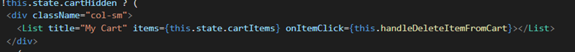

## Tutorial 8
### What I have learned today
- Lifecycle pada sebuah component
- Routing di react app
- Axios dan cara untuk memproses request tersebut.

### Pertanyaan
1.Ceritakan langkah - langkah yang kalian lakukan untuk solve LATIHAN no.1, dan mengapa kalian melakukan langkah - langkah tersebut?

Pada latihan 1, diceritakan pada tutorial bahwa setelah melakukan submit (tidak di-refresh),  klik lagi tombol “Add New Item” akan dijumpai bahwa form masih berisi value dari item sebelumnya yang ditambahkan. Hal tersebut tersebut terjadi karena pada handler handleSubmitItem() setelah data item di post ke API, tidak ada setState untuk mereset value dari masing-masing state seperti title, price, description, category, dan quantity. Akibatnya, ketika selesai melakukan submit item lalu klik Add Item kembali (tanpa refresh) dan modal muncul, modal masih mengandung nilai state dari item sebelumnya yang di-submit. 
Langkah-langkah yang saya lakukan untuk solve latihan no 1 adalah dengan menambahkan setState untuk masing-masing state setelah data item di post ke API seperti kode di bawah ini :

Sebelumnya, pada const data, masing-masing state di set sesuai data dari item yang dipassing ke handler tersebut. Setelah itu, const data di post ke API untuk menambahkan item ke daftar item di database. Setelah itu, ditambahkan setState untuk mereset nilai dari masing-masing state menjadi seperti semula. Hal ini dilakukan agar ketika kita menge-klik Add Item, modal tidak memunculkan nilai dari item sebelumnya. Modal mengambil nilai dari masing-masing state berdasarkan nilainya saat itu dan nilai saat itu sudah direset menjadi seperti semula sehingga tidak mengandung data item sebelumnya. Lalu, data daftar item diload kembali. 

2. Jelaskan fungsi dari async dan await!
-	Async/Await adalah salah satu cara untuk mengatasai masalah asynchronous pada Javascript berupa syntax khusus yang digunakan untuk bekerja dengan Promise agar lebih nyaman dan mudah untuk digunakan. Async/Await terbagi menjadi Async dan Await.
-	Async merupakan sebuah fungsi yang mengembalikan sebuah Promise. Async ditambahkan didepan suatu function yang berfungsi untuk menjadikan function tersebut asinkronus. 
-	Await sendiri merupakan fungsi yang hanya berjalan di dalam Async. Await digunakan pada function yang menggunakan Async dan berfungsi untuk menunda eksekusi hingga proses asinkronus selesai, artinya kode setelah baris yang mengandung Await tidak akan dieksekusi sampai proses di Await selesai (menunda jalannya Async hingga proses dari Await berhasil di eksekusi). 

Sumber : 

https://www.kawankoding.id/javascript-async-await/

https://www.matawebsite.com/blog/mengenal-async-await-javascript

3. Masukkan jawaban dari Screenshot yang diperintahkan di halaman 9 pada Component Lifecycle pada pertanyaan ini.
1) Menambahkan kode di file index.js di folder ItemList

2) Membuka terminal / command line, pindah ke folder frontend-minicommerce, lalu jalankan npm start

3) Membuka browser (jika tidak terbuka secara otomatis), lalu masukkan url http://localhost:3000/. Setelah itu, buka inspect element, kemudian arahkan ke tab console .

4) Terdapat render() dan componentDidMount(), namun tidak terdapat shouldComponentUpdate() 
5) shouldComponentUpdate hanya akan dipanggil ketika props atau state dari sebuah Component berubah, sedangkan kita tidak mengubah props atau state pada komponen Items tersebut
6) Menambahkan isLoading pada state pada komponen ItemList

7) Menambahkan sebuah handler dan button untuk mengubah isLoading yang ada pada state

Melakukan binding method ke Class Component.

8) Membuka browser dan akan muncul sebuah button baru sesuai spesifikasi

9) Klik tombol changeState dan lihat apa yang terjadi pada console. shouldComponentUpdate() kini hadir disana dan terlihat bahwa value dari isLoading berubah setiap di klik

 
   

4. Jelaskan fungsi dari componentDidMount, shouldComponentUpdate, componentDidUpdate, componentWillReceiveProps, componentWillUnmount.
Notes : Penjelasan harus mencantumkan “kapan fungsi dipanggil” dan “use case apa saja yang biasanya menggunakan lifecycle method tersebut”. 
 
Fase mounting adalah fase ketika components dibuat atau pertama kali dirender ke DOM. Fase updating adalah fase ketika sebuah component akan di render ulang, biasanya ini terjadi ketika ada perubahan pada state atau props yang mengakibatkan perubahan DOM. Fase unmounting adalah fase ketika component dihapus dari DOM.

Fungsi dari :

componentDidMount => adalah salah satu fungsi/method pada fase mounting (berperan untuk membuat components). Fungsi ini dipanggil ketika kita ingin mengakses dan memanipulasi DOM sebelum elemen UI/JSX dimuat. Contoh use case yang menggunakan fungsi ini adalah request data dari API menggunakan Axios, pembuatan component, dan load data API. 

shouldComponentUpdate => adalah salah satu fungsi/method pada fase updating. Fungsi ini dipanggil ketika akan menentukan apakah sebuah component akan di render ulang atau tidak. Method ini akan mengembalikan nilai boolean true & false, jika true maka component akan di render ulang atau sebaliknya. Contoh use case yang menggunakan fungsi ini adalah ketika akan memeriksa apakah ada perubahan pada suatu properti tertentu yang menentukan apakah suatu komponen akan diperbarui. 

componentDidUpdate => adalah salah satu fungsi/method pada fase updating. Fungsi ini dipanggil ketika ingin mengakses dan memanipulasi DOM serta request data setelah fungsi render dipanggil dan segera setelah component diperbarui. Contoh use case yang menggunakan fungsi ini adalah mengupdate size suatu component ketika suatu button sudah di click atau mengupdate elemen HTML lainnya setelah data diperbarui. 

componentWillReceiveProps => adalah salah satu fungsi/method pada fase updating. Fungsi ini dipanggil ketika state yang ada di component akan di update atau di ubah dengan nilai props yang baru. Contoh use case yang menggunakan fungsi ini adalah mengupdate component sesuai nilai props atau reset state sesuai nilai prop. 

componentWillUnmount => adalah salah satu fungsi/method pada fase unmounting. Fungsi ini dipanggil ketika sebuah component ingin dihapus dari DOM dan dipanggil segera sebelum component dilepas dan dihancurkan. Contoh use case yang menggunakan fungsi ini adalah membatalkan timer, membatalkan network request, dan menghapus apapun yang dibuat pada componentDidMount().

Sumber :

https://reactjs.org/docs/react-component.html

https://medium.com/codeacademia/apa-itu-component-lifecycle-di-react-bfcb64f64e0e

https://www.konsepkoding.com/2020/03/tutorial-dan-penjelasan-lifecycle-reactnative.html

### What I did not understand
- [ ] Algoritma dan syntax yang digunakan di react app secara mendalam
(Anda dapat membuat tampilan code dalam README.md menjadi lebih baik. Cari tahu
lebih dalam tentang penulisan README.md di GitHub pada link
[berikut](https://help.github.com/en/articles/basic-writing-and-formatting-syntax))

---
## Tutorial 7
### What I have learned today
1. Mengenal dan menggunakan ReactJS
2. Belajar istilah, arsitektur, dan design di ReactJS
3. Belajar perbedaan class component dan functional component
4. Belajar perbedaan state dan props

### Pertanyaan
1.Jelaskan apa yang Anda lakukan di latihan dalam satu paragraf per-soal. Berikan screenshot sebagai ilustrasi dari apa yang Anda jelaskan.

Soal 1 : hapus item dari cart dengan button delete dan menampilkan kembali tombol keranjang

Pertama, saya membuat suatu handler untuk menghapus item dari cart bernama “handleDeleteItemFromCart” yang dipanggil ketika button delete diklik pada kode dibawah ini:  

Button delete tersebut berasal dari fungsi CustomIconButton pada komponen Item 

Handler “handleDeleteItemFromCart” berisi suatu algoritma yang akan menghapus item dari MyCart. Berikut ini adalah isi dari handler “handleDeleteItemFromCart” :
 

*Catatan : untuk bagian balance dapat diabaikan terlebih dahulu 

Pada handler tersebut, pertama, array cartItems di copy dan dimasukkan dalam variabel nowItems untuk menyimpan list item yang saat ini masuk dalam My Cart. Kedua, copy objek item yang akan dihapus lalu dimasukkan dalam variabel delItem untuk menyimpan item yang akan dihapus dari cart ketika button delete di click. Lalu, kita ubah atribut inCart dari item yang dihapus menjadi false untuk menunjukkan bahwa item dihilangkan dari cart. Selanjutnya, buat suatu array “baru” yang memfilter item berdasarkan id nya, yaitu masukkan semua item selain item yang memiliki id seperti item yang akan didelete, yang berarti kita akan menghilangkan item dari My Cart. Lalu, kita lakukan set state (mengatur status) dari array cartItems dengan array “baru” tersebut. Sehingga, saat ini array cartItems berisi semua item dalam cart, kecuali yang sudah dihapus. Selanjutnya, item yang dihapus dari cart tersebut akan diupdate di shopItems dengan nilai atribut inCart yang false melalui handler updateShopItem yang berisi seperti ini :

Nilai atribut inCart yang false tersebut akan membuat item yang dihapus dari cart tersebut kembali memiliki icon tombol keranjang pada halaman List Item melalui kode yang terdapat pada screenshot CustomIconButton yang sudah dilampirkan di atas. 

Soal 2 : mengurangi balance saat item masuk keranjang dan menambah balance saat item keluar keranjang

Untuk mengurangi balance saat item masuk keranjang, saya memasukkan algoritma set state balance di handler “handleDeleteItemFromCart” dan handler ”handleAddItemToCart”. Pada handleDeleteItemFromCart, saya melakukan set state balance (mengatur status balance) dengan nilai status balance saat ini (this.state.balance) ditambah dengan harga dari item yang akan dihapus dari My Cart (delItem.price). Hal tersebut menunjukkan bahwa ketika item dihapus dari My Cart, maka uang (balance) juga bertambah sesuai harga itemnya. Berikut ini adalah kodenya :

Pada handleAddItemToCart, saya melakukan set state balance dengan status balance saat ini (this.state.balance) dikurangi dengan harga dari item yang akan ditambah ke cart (newItem.price). Hal tersebut menunjukkan bahwa ketika item ditambah ke My Cart, maka uang juga berkurang sesuai harga item tersebut. Berikut ini adalah kodenya :
 

Soal 3 : Alert bahwa balance tidak cukup

Untuk memunculkan bahwa balance tidak cukup, saya membuat suatu algoritma di handler “handleAddItemToCart” yang mengecek apakah status balance saat ini (this.state.balance) lebih besar atau sama dengan harga item yang akan ditambah (newItem.price). Jika iya, tandanya uang masih mencukupi untuk membeli item. Maka, item dapat dimasukkan ke My Cart. Namun jika tidak (else), maka berarti bahwa uang sudah tidak mencukupi untuk membeli item (memasukkan item ke cart) sehingga perlu diberikan alert bahwa uang tidak mencukupi (“Balance not sufficient!”). Berikut ini adalah kodenya :

2.Menurut pemahaman kamu selama pengerjaan tutorial ini, apa perbedaan antara state dan props?

Props :

1. Data di-passing dari satu komponen ke komponen lainnya.
2. Immutable (tidak dapat dimodifikasi)
3. Dapat digunakan dengan state dan functional components
4. Hanya dapat dibaca (read-only)

State :
1. Data di-passing dalam komponen saja
2. Mutable (dapat dimodifikasi)
3. Hanya dapat digunakan dengan state component atau class component
4. Dapat dibaca dan ditulis

Sumber : 

Pemahaman sendiri 

https://www.geeksforgeeks.org/what-are-the-differences-between-props-and-state/

3. Menurut kamu, apakah sebaiknya kita menggunakan component (e.g. List, Item) dalam React? sebutkan alasannya.

Ya, kita sebaiknya menggunakan component (e.g. List, Item)  dalam React yang dapat berbentuk class atau function tersebut utamanya agar lebih modular (setiap komponen memiliki fungsinya masing-masing) dan kode yang lebih reusable. Setiap class atau function tersebut menyediakan fungsi yang berbeda-beda sehingga lebih mudah dalam mengatur apabila terdapat perubahan atau kesalahan. Mereka melayani tujuan yang sama seperti fungsi JavaScript namun bekerja secara terpisah dan mengembalikan HTML. Component ini membuat kode lebih mudah dibaca, dimengerti, dan ditest. 

Sumber :

https://reactjs.org/docs/react-component.html
https://www.w3schools.com/react/react_components.asp

4. Apa perbedaan class component dan functional component?

Functional component :

1. Hanya suatu fungsi JavaScript biasa yang menerima props sebagai argumen dan mengembalikan elemen React.
2. Tidak ada method render yang digunakan.
3. Juga dikenal sebagai komponen Stateless karena mereka hanya menerima data dan menampilkannya dalam beberapa bentuk, yang terutama bertanggung jawab untuk merender UI.
4. Didalamnya tidak dapat digunakan react lifecycle method (seperti componentDidMount)
5. Hooks dapat dengan mudah digunakan
6. Constructor tidak digunakan

Class component :

1. Harus meng-extend dari React. Komponen dan buat fungsi render yang mengembalikan elemen React.
2. Harus terdapat method render() yang mengembalikan HTML.
3. Juga dikenal sebagai komponen Stateful karena mereka mengimplementasikan logika dan status.
4. Dapat menggunakan react lifecycle method di dalam classnya (seperti componentDidMount)
5. Membutuhkan sintaks yang berbeda untuk mengimplementasikan hooks
6. Constructor digunakan karena perlu menyimpan status

Sumber :

https://www.geeksforgeeks.org/differences-between-functional-components-and-class-components-in-react/

5. Dalam react, apakah perbedaan component dan element?

Element dalam react adalah objek biasa yang menggambarkan instance komponen atau simpul DOM dan properti yang diinginkan. Element hanya berisi informasi tentang jenis komponen (misalnya, Tombol), propertinya (misalnya, warnanya), dan elemen turunan apa pun di dalamnya. Sebuah elemen adalah cara untuk memberi tahu React apa yang ingin ditampilkan pada layar. Kita tidak dapat memanggil metode apa pun pada elemen. Element hanya objek deskripsi yang tidak dapat diubah dengan memiliki 2 field: type: (string | ReactClass) dan props: Object1. Element dapat merepresentasikan DOM element maupun component element. 

Component dalam react adalah fungsi atau class yang menerima input (props) dan mengembalikan react element sebagai output. Component dapat berupa class yang meng-extend React.Component dengan fungsi render() sebagai class component, atau komponen fungsional yang stateless sebagai functional component. Dibutuhkan props sebagai input dan return elemen sebagai output. Nama komponen dimulai dengan huruf kapital. Class component sedikit lebih kuat daripada functional component karena dapat menyimpan beberapa keadaan lokal dan melakukan logika khusus ketika simpul DOM yang sesuai dibuat atau dihancurkan. Functional component kurang kuat tetapi lebih sederhana, dan bertindak seperti class component hanya dengan satu metode render(). 

Sumber :

https://reactjs.org/blog/2015/12/18/react-components-elements-and-instances.html

### What I did not understand
- [ ] Penggunaan ReactJS secara lebih mendalam.
(Anda dapat membuat tampilan code dalam README.md menjadi lebih baik. Cari tahu
lebih dalam tentang penulisan README.md di GitHub pada link
[berikut](https://help.github.com/en/articles/basic-writing-and-formatting-syntax))

 ---

## Tutorial 6
### What I have learned today
- Perbedaan otentikasi dan otorisasi
- Mengimplementasikan Spring Boot Starter Security
- Membuat otorisasi fitur yang berbeda-beda untuk tiap role dari user
- Menyimpan password milik user dalam bentuk hashed

### Pertanyaan
1.Jelaskan secara singkat perbedaan Otentikasi dan Otorisasi! Di bagian mana (dalam kode yang telah anda buat) konsep tersebut diimplementasi?

Otentikasi adalah proses identifikasi pengguna apakah pengguna terdaftar dalam suatu sistem aplikasi. Proses otentikasi akan melakukan verifikasi terhadap siapa yang mencoba untuk mengakses sistem aplikasi (verifikasi identitas pengguna). 

Otorisasi adalah proses menentukan apakah pengguna saat ini (yang sudah terotentikasi) diperbolehkan atau diberikan suatu akses untuk melakukan tugas/action tertentu ataukah tidak. Tugas/action ini dapat disebut juga melakukan manipulasi terhadap suatu sumber daya tertentu. 
Untuk otentikasi, konsep tersebut diimplementasikan pada bagian ketika user ingin melakukan login. Ketika user memasukkan username dan password, username dan password tersebut akan dicek apakah terdapat pada database dari UserModel. Jika ya, maka user teridentifikasi sebagai pengguna yang terdaftar dalam suatu sistem aplikasi. Berikut ini adalah kodenya pada class WebSecurityConfig.java :

 
Untuk otorisasi, konsep tersebut diimplementasikan pada bagian ketika user ingin melakukan tugas/action tertentu, misalnya menambah destinasi. Pengguna yang boleh menambah destinasi hanya user yang memiliki role Agen. User dengan role lain hanya dapat melihat detail saja, namun tidak dapat mengakses atau melihat halaman tambah (termasuk tombol tambah). Hal tersebut diimplementasikan dengan pengecekan role Agen terlebih dahulu. Jika role sesuai, maka user dapat melakukan tugas/action atau melakukan manipulasi sumber daya tertentu pada aplikasi. Berikut ini adalah kodenya pada WebSecurityConfig.java :

Sumber :

https://www.sailpoint.com/identity-library/difference-between-authentication-and-authorization/#:~:text=Simply%20put%2C%20authentication%20is%20the,a%20user%20has%20access%20to.

2.Apa itu BCryptPasswordEncoder? Jelaskan secara singkat cara kerja dan tujuannya.

BcryptPasswordEncoder adalah Implementasi PasswordEncoder yang menggunakan fungsi hashing kuat BCrypt. Klien dapat secara opsional menyediakan "kekuatan" (alias log rounds di BCrypt) dan instansi SecureRandom. Semakin besar parameter kekuatan, semakin banyak pekerjaan yang harus dilakukan (secara eksponensial) untuk meng-hash kata sandi. Nilai defaultnya adalah 10.
Cara kerjanya yaitu BCryptPasswordEncoder secara otomatis menghasilkan dan menggunakan random salt untuk menghitung hash. Setiap panggilan, akan memiliki hasil yang berbeda, sehingga kita hanya perlu mengkodekan sandi sekali. Untuk membuat salt generation bekerja, BCrypt akan menyimpan salt didalam nilai hash itu sendiri. Misalnya, hash value nya adalah

$2a$10$ZLhnHxdpHETcxmtEStgpI./Ri1mksgJ9iDP36FmfMdYyVg9g0b2dq

1. "2a" mewakili versi algoritma Bcrypt
2. "10" mewakili kekuatan algoritme
3. "ZLhnHxdpHETcxmtEStgpI." adalah bagian generated salt. Pada dasarnya, 22 karakter pertama adalah salt. Bagian yang tersisa dari bidang terakhir adalah versi hash sebenarnya dari teks biasa. 

Perlu diketahui juga bahwa algoritma BCrypt menghasilkan String dengan panjang 60, jadi kita perlu memastikan bahwa kata sandi akan disimpan dalam kolom yang dapat menampungnya. Kesalahan umum adalah membuat kolom dengan panjang yang berbeda dan kemudian mendapatkan kesalahan Nama Pengguna atau Kata Sandi Tidak Valid pada waktu otentikasi. 

Aplikasi Spring Boot menggunakan BCryptPasswordEncoder dengan tujuan untuk menyandikan dan memvalidasi kata sandi pengguna untuk aplikasi tersebut. BCryptPasswordEncoder default adalah implementasi default dari algoritma BCrypt. Kelas BCryptPasswordEncoder memungkinkan kompleksitas algoritma pengkodean ditingkatkan dengan menggunakan nilai kekuatan sebagai argumen.

Sumber :

https://www.yawintutor.com/bcryptpasswordencoder-bad-strength/

https://docs.spring.io/spring-security/site/docs/3.2.5.RELEASE/apidocs/org/springframework/security/crypto/bcrypt/BCryptPasswordEncoder.html

https://www.baeldung.com/spring-security-registration-password-encoding-bcrypt

3. Apakah penyimpanan password sebaiknya menggunakan encryption atau hashing? Mengapa demikian?

Penyimpanan password sebaiknya menggunakan hashing, karena hashing adalah teknik enkripsi satu arah yang berarti bahwa tidak mungkin untuk merekayasa balik nilai hash untuk mendapatkan kembali teks asli (plain text) passwordnya. Password membutuhkan proses yang aman seperti itu. Kata sandi pengguna dijalankan melalui fungsi hash dan disimpan dalam database. Setiap kali pengguna masuk, database meng-hash kata sandi yang mereka masukkan dan memeriksa untuk melihat apakah hash yang dimasukkan cocok dengan hash yang mereka miliki di file. Jika ya, pengguna dapat masuk. Dengan hash, aplikasi/situs tidak pernah menyimpan kata sandi yang sebenarnya di mana pun, dan peretas yang membobol hanya akan mendapatkan daftar huruf dan angka yang tidak dapat didekodekan. Bergantung pada seberapa kuat algoritmanya, hash ini bisa sangat sulit untuk dipecahkan. 

Sumber:

https://www.maketecheasier.com/password-hashing-encryption/

4. Jelaskan secara singkat apa itu UUID beserta penggunaannya!

UUID adalah singkatan dari Universal Unique Identifier. UUID ini adalah angka 128-bit yang digunakan untuk mengidentifikasi secara unik suatu objek atau entitas di internet. UUID terdiri dari 16 oktet dan direpresentasikan sebagai 32 base-16 character, yang dapat digunakan untuk mengidentifikasi informasi lintas atau di seluruh sistem komputer. 

UUID umumnya digunakan untuk mengidentifikasi informasi yang perlu unik dalam sistem atau jaringannya. Keunikannya membuatnya berguna untuk menjadi kunci asosiatif dalam database dan pengidentifikasi untuk perangkat keras fisik dalam suatu organisasi. 

Sumber :

https://searchapparchitecture.techtarget.com/definition/UUID-Universal-Unique-Identifier

https://duo.com/labs/tech-notes/breaking-down-uuids

5. Apa kegunaan class UserDetailsServiceImpl.java? Mengapa harus ada class tersebut padahal kita sudah memiliki class UserRoleServiceImpl.java?

Class UserDetailsServiceImpl.java adalah sebuah class java yang mengimplementasikan interface UserDetailsService yang diimport dari org.springframework.security.core. UserDetailsServiceImpl.java berguna sebagai implementasi read-only method yaitu mengambil atau mengakses data pengguna (user-specific data) dalam database, dalam hal ini adalah database untuk UserModel (user). Nama methodnya adalah loadUserByUsername(String username) yang akan menemukan pengguna berdasarkan parameter username.  

Kita tetap membutuhkan class tersebut karena UserDetailsServiceImpl.java dan UserRoleServiceImpl.java memiliki fungsi yang berbeda. UserRoleServiceImpl.java berfungsi sebagai akses kepada database untuk RoleModel (role) sedangkan UserDetailsServiceImpl.java berfungsi sebagai akses kepada database untuk UserModel (user). Selain itu, UserDetailsServiceImpl.java sangat penting karena digunakan sebagai sarana otentikasi pengguna aplikasi dengan cara mengakses data UserModel dalam database. 

Sumber :

https://docs.spring.io/spring-security/site/docs/3.0.x/apidocs/org/springframework/security/core/userdetails/UserDetailsService.html

### What I did not understand
- [ ] Penggunaan Spring Boot Starter Security secara lebih mendalam.
(Anda dapat membuat tampilan code dalam README.md menjadi lebih baik. Cari tahu
lebih dalam tentang penulisan README.md di GitHub pada link
[berikut](https://help.github.com/en/articles/basic-writing-and-formatting-syntax))

## Tutorial 5 
### What I have learned today
- Belajar bagaimana mengimplementasikan web service
- Belajar cara membuat dan mengakses web service dengan berbagai method yang ada
- Belajar cara menggunakan postman

### Pertanyaan

1.Apa itu Postman? Apa kegunaannya?
Postman adalah aplikasi yang berfungsi sebagai Rest Client. Aplikasi ini digunakan untuk uji coba Rest API. Postman biasa digunakan oleh pengembang pembuat API sebagai alat untuk menguji API yang telah dibuat. 

Sumber : 
https://antares.id/id/postman.html

2. Jelaskan fungsi dari anotasi @JsonIgnoreProperties dan @JsonProperty.
Fungsi :

@JsonIgnoreProperties digunakan di tingkat kelas untuk menandai properti atau daftar properti yang akan diabaikan. @JsonIgnoreProperties dianotasi di tingkat kelas dan kita perlu menentukan properti logis dari kelas itu untuk mengabaikannya. @JsonIgnoreProperties memiliki elemen yang allowGetters, allowSetter, ignoreUnknown dan value. Elemen value di @JsonIgnoreProperties menentukan nama properti yang akan diabaikan.

@JsonProperty mendefinisikan properti logis yang digunakan dalam serialisasi dan deserialisasi JSON. Ketika kita mengatur data JSON ke Objek Java, hal itu disebut deserialization JSON dan ketika kita mendapatkan data JSON dari Java Object, hal itu disebut serialisasi JSON. @JsonProperty dapat mengubah visibilitas properti logis menggunakan elemen aksesnya selama serialisasi dan deserialisasi JSON. @JsonProperty dapat dianotasi di non-static setter or getter method atau non-static object field.

Sumber : 

https://www.concretepage.com/jackson-api/jackson-jsonproperty-and-jsonalias-example

https://www.tutorialspoint.com/jackson_annotations/jackson_annotations_jsonignoreproperties.htm

https://www.concretepage.com/jackson-api/jackson-jsonignore-jsonignoreproperties-and-jsonignoretype

3. Apa kegunaan atribut WebClient?

WebClient adalah antarmuka yang mewakili titik masuk utama untuk melakukan web requests. WebClient dibuat sebagai bagian dari modul Spring Web Reactive, dan merupakan klien web non-pemblokiran (non-blocking) dan reaktif untuk melakukan HTTP request, memperlihatkan API reaktif yang fluent melalui HTTP client libraries seperti Reactor Netty.  

Sumber :

https://www.baeldung.com/spring-5-webclient

https://docs.spring.io/spring-framework/docs/current/javadoc-api/org/springframework/web/reactive/function/client/WebClient.html

4. Apa itu ResponseEntity dan BindingResult? Apa kegunaannya? 

ResponseEntity adalah ekstensi HttpEntity yang menambahkan HttpStatus status code. Digunakan di RestTemplate serta dalam @Controller method. ResponseEntity mewakili seluruh respons HTTP: kode status, header, dan isi. Kegunaannya adalah untuk manipulasi HTTP response dengan mengatur body, status dan header dari HTTP response.

BindingResult adalah antarmuka umum yang merepresentasikan binding result (hasil meningkat). Kegunaannya adalah untuk memperluas antarmuka untuk kemampuan registrasi kesalahan, memungkinkan Validator untuk diterapkan, dan menambahkan analisis khusus pengikatan dan pembuatan model.

Sumber :

https://docs.spring.io/spring-framework/docs/current/javadoc-api/org/springframework/http/ResponseEntity.html

https://www.baeldung.com/spring-response-entity

https://docs.spring.io/spring-framework/docs/current/javadoc-api/org/springframework/validation/BindingResult.html

### What I did not understand
- [ ] Masih belum sepenuhnya memahami mekanisme mengenai web service seutuhnya.
(Anda dapat membuat tampilan code dalam README.md menjadi lebih baik. Cari tahu
lebih dalam tentang penulisan README.md di GitHub pada link
[berikut](https://help.github.com/en/articles/basic-writing-and-formatting-syntax))

=======

## Tutorial 4

### What I have learned today

- Saya belajar konsep view pada Spring Boot
- Saya belajar apa itu Thymeleaf dan kegunaannya

### Pertanyaan

1. Jelaskan perbedaan th:include dan th:replace!

th:include => memasukkan hanya konten dari fragmen yang ditentukan kepada atau sebagai bagian dari tagnya. Atribut th:include ini menyisipkan fragmen yang ditentukan sebagai badan tag inangnya tetapi tanpa menyisipkan fragment tag nya.

th:replace => mengganti (replace) tag inangnya nya dengan fragmen yang ditentukan atau didefinisikan pada tag inang tersebut. Atribut th:replace ini akan menggantikan tag host (inang) dengan fragmen tersebut. Hal tersebut berarti akan menghapus tag inang dan menggantikan tag inang dengan konten fragmen beserta fragment tag nya.

Sumber :

https://www.thymeleaf.org/doc/tutorials/3.0/usingthymeleaf.html

2. Jelaskan apa fungsi dari th:object!

Fungsi dari atribut th:object yaitu untuk menentukan objek yang terikat oleh data formulir yang dikirimkan. Masing-masing field dipetakan menggunakan atribut th:field=”*{nama}”, dimana ‘nama’ adalah properti objek yang sesuai dengan objek tersebut. Atribut th:object mendefinisikan objek mana yang dirujuk oleh _field_.

Sumber :

https://www.baeldung.com/thymeleaf-in-spring-mvc

https://stackabuse.com/getting-started-with-thymeleaf-in-java-and-spring/

3. Jelaskan perbedaan dari * dan $ pada saat penggunaan th:object! Kapan harus dipakai?

syntax $ => digunakan untuk menspesifikkan objek pada saat menggunakan atribut th:object. Syntax ${} pada atribut th:object dipakai ketika ingin memilih objek yang ingin digunakan.

syntax * => digunakan untuk menspesifikkan properti objek dari objek yang didefinisikan pada atribut th:object. Ketika suatu object telah didefinisikan pada atribut th:object dengan syntax ${}, maka kita dapat menggunakan syntax *{} untuk menspesifikkan properti dari objek tersebut. 

Sumber:

https://o7planning.org/12385/thymeleaf-th-object-and-asterisk-syntax

### What I did not understand

- [ ] Masih belum memahami syntax dari penggunaan Thymeleaf

(Anda dapat membuat tampilan code dalam README.md menjadi lebih baik. Cari tahu
lebih dalam tentang penulisan README.md di GitHub pada link
[berikut](https://help.github.com/en/articles/basic-writing-and-formatting-syntax))

## Tutorial 3

### What I have learned today
-	Saya belajar Create, Read, Update, dan Delete (CRUD) pada basis data dengan menggunakan konsep MVC dalam project Spring Boot.
-	Saya belajar model yang terhubung dengan basis data.
-	Saya belajar JPARepository untuk melakukan query pada basis data.

### Pertanyaan

1. Tolong jelaskan secara singkat apa kegunaan dari anotasi-anotasi yang ada pada model (@AllArgsConstructor, @NoArgsConstructor, @Setter, @Getter, @Entity, @Table)
   Kegunaan :

@AllArgsConstructor : lombok menghasilkan konstruktor dengan 1 parameter untuk setiap field di class kita.

@NoArgsConstructor : lombok menghasilkan konstruktor tanpa parameter.

@Setter : lombok membuat metode default untuk set (setter) nilai atribut/field secara otomatis.

@Getter : lombok membuat metode default untuk get (getter) nilai atribut/field secara otomatis.

@Entity : mendefinisikan sebuah entitas agar JPA mengetahui terdapat entitas tersebut.

@Table : menspesifikasikan nama tabel dalam database karena biasanya nama tabel dalam database dan nama entitas tidak sama.

Sumber :
https://projectlombok.org/features/constructor
https://projectlombok.org/features/GetterSetter
https://www.baeldung.com/jpa-entities

2. Pada class TravelAgensiDb, terdapat method findByNoAgensi, apakah kegunaan dari method tersebut?

Kegunaan method findByNoAgensi yang terdapat pada class TravelAgensiDb adalah untuk mencari suatu travel agensi di database tabel Travel Agensi berdasarkan parameter noAgensi yang di passing ke method tersebut. Method ini nantinya akan mengembalikan objek TravelAgensiModel sesuai dengan noAgensi yang diminta.  

3. Jelaskan perbedaan kegunaan dari anotasi @JoinTable dan @JoinColumn

Kegunaan :

@JoinTable : untuk mendefinisikan tabel join/link. Anotasi ini digunakan untuk menentukan pemetaan asosiasi entitas.

@JoinColumn : untuk menentukan kolom join/link dengan tabel utama, yaitu untuk memetakan kolom gabungan database dalam entitas (kolom yang tergabung ke asosiasi entitas atau koleksi elemen).

Sumber :
https://www.baeldung.com/hibernate-many-to-many
https://javabydeveloper.com/difference-between-joincolumn-and-mappedby/
https://docs.oracle.com/javaee/7/api/javax/persistence/JoinTable.html

4. Pada class TourGuideModel, digunakan anotasi @JoinColumn pada atribut agensi, apa kegunaan dari name, referencedColumnName, dan nullable dalam anotasi tersebut? dan apa perbedaan nullable dan penggunaan anotasi @NotNull

Kegunaan dari name, referencedColumnName, dan nullable dalam anotasi tersebut menunjukkan kolom dari AgensiModel yang di-join atau diasosiasikan dengan tabel utama (TourGuideModel).

Perbedaan :

Nullable : nullable didefinisikan sebagai bagian dari spesifikasi Java Persistence API. Hal ini digunakan terutama dalam pembuatan metadata skema DDL. Hal ini berarti bahwa jika kita membiarkan Hibernate menghasilkan skema database secara otomatis, itu menerapkan not null constraint ke kolom database tertentu.

@NotNull : Anotasi @NotNull didefinisikan dalam spesifikasi Bean Validation. Hal ini berarti penggunaannya tidak terbatas hanya pada entitas. Hibernate tidak memicu SQL insert statement. Akibatnya, data yang tidak valid tidak disimpan ke database (terdapat validasi terlebih dahulu).

Sumber :
https://www.baeldung.com/hibernate-notnull-vs-nullable

5. Jelaskan kegunaan FetchType.LAZY, CascadeType.ALL, dan FetchType.EAGER

Kegunaan :

FetchType.LAZY : mengambil data dari database dengan cara memuatnya sesuai permintaan (ketika ingin mengakses saja), misalnya saat terdapat suatu method get.

CascadeType.ALL : menyebarkan (cascade) semua operasi EntityManager (PERSIST, REMOVE, REFRESH, MERGE, DETACH) ke entitas terkait.

FetchType.EAGER : mengambil data dari database dengan cara memuatnya bersamaan dengan field lainnya atau ketika parent mereka diambil dari database.

Sumber :
https://newbedev.com/difference-between-fetchtype-lazy-and-eager-in-java-persistence-api
https://newbedev.com/what-is-the-meaning-of-the-cascadetype-all-for-a-manytoone-jpa-association

### What I did not understand
- [ ] Masih belum begitu memahami penggunaan JPA Repository
  (Anda dapat membuat tampilan code dalam README.md menjadi lebih baik. Cari tahu
  lebih dalam tentang penulisan README.md di GitHub pada link
  [berikut](https://help.github.com/en/articles/basic-writing-and-formatting-syntax))

---

## Tutorial 2

### What I have learned today
- Saya belajar bagaimana caranya melakukan organizing domain logic & service layer. 
- Saya mempelajari konsep MVC dengan mempelajari tentang model dan service.
- Saya belajar membuat sebuah model dengan konsep MVC dalam project Spring Boot.
- Saya belajar membuat service untuk create & read data menggunakan konsep MVC dalam project Spring Boot

### Pertanyaan
1. Cobalah untuk menambahkan sebuah Agensi dengan mengakses link berikut:
http://localhost:8080/agensi/add?idAgensi=1&namaAgensi=Papa%20APAP&alamat=Maung%20Fasilkom&noTelepon=081xxx

Apa yang terjadi? Jelaskan mengapa hal tersebut dapat terjadi

Ketika mengakses link tersebut terjadi error bernama “Whitelabel Error Page”. Hal ini dikarenakan view template yang telah dicantumkan pada Controller, yaitu “add-agensi” belum dibuat sehingga Controller tidak dapat me¬ngembalikan view template tersebut dan akhirnya request mapping saat routing URL tidak dapat dilakukan. Controller tidak dapat melakukan resolving template “add-agensi” karena template belum dibuat dan akhirnya menyebabkan error tersebut. 

2. Menurut kamu anotasi @Autowired pada class Controller tersebut merupakan implementasi dari konsep apa? Dan jelaskan secara singkat cara kerja @Autowired tersebut dalam konteks service dan controller yang telah kamu buat

Menurut saya, anotasi @Autowired pada class Controller tersebut merupakan implementasi dari konsep dependency injection pada Spring Framework. Cara kerjanya :
1. Fitur component-scan pada Spring Framework akan melihat isi package yang kita sebutkan, lalu akan mencari class-class yang diberikan anotasi @Repository, @Service, @Controller, dan @Component, dalam hal ini adalah class TravelAgensiController. 
2. Setelah ditemukan, Spring FrameWork akan melakukan inisialisasi terhadap class tersebut, dan melakukan dependency injection dengan cara mengisi semua kebutuhan class TravelAgensiController, dalam hal ini adalah kebutuhan untuk melakukan inisialisasi objek atau properti TravelAgensiService. 
3. Anotasi @Autowired membuat dependency injection tidak memerlukan setter ataupun constructor injection. 
4. Dengan anotasi @Autowired, properti TravelAgensiService akan diisikan oleh Spring dengan object bertipe-data sesuai, dalam hal ini adalah tipe data TravelAgensiService. Dengan kata lain, anotasi @Autowired ini akan melakukan inisialisasi objek TravelAgensiService untuk keperluan kebutuhan class TravelAgensiController.
5. Objek tersebut digunakan oleh class TravelAgensiController untuk membantu bagian Controller dalam melaksanakan layanan manipulasi class TravelAgensi pada bagian Service yang berisi interface TravelAgensiService beserta class yang mengimplementasikan interface tersebut. 

Sumber : https://software.endy.muhardin.com/java/memahami-dependency-injection/

3. Cobalah untuk menambahkan sebuah Agensi dengan mengakses link berikut:
http://localhost:8080/agensi/add?idAgensi=1&namaAgensi=Papa%20APAP&alamat=Maung%20Fasilkom

Apa yang terjadi? Jelaskan mengapa hal tersebut dapat terjadi.

Yang terjadi ketika mengakses link tersebut adalah error bernama “Whitelabel Error Page”. Hal ini dikarenakan pada link untuk add agensi tersebut tidak mengandung parameter noTelepon (required requested parameter ‘noTelepon’). Sedangkan value noTelepon dengan tipe String merupakan salah satu value RequestParam yang diperlukan dalam melakukan RequestMapping saat routing URL untuk melakukan penambahan agensi. Maka, terjadilah error. 

4. Jika Papa APAP ingin melihat Travel Agensi dengan nama Papa APAP, link apa yang harus diakses?
http://localhost:8080/agensi/view?idAgensi=1

5. Tambahkan 1 contoh Travel Agensi lainnya sesukamu. Lalu cobalah untuk mengakses http://localhost:8080/agensi/viewAll , apa yang akan ditampilkan?
Sertakan juga bukti screenshotmu

Penambahan 1 contoh Travel Agensi bernama Zeberina, dengan ID = 23, alamat nya Batan Indah, dan nomor teleponnya 08129

Yang akan ditampilkan oleh link diatas adalah daftar TravelAgensi yang ditambahkan, termasuk yang baru saja ditambahkan. 

Link penambahan TravelAgensi :
http://localhost:8080/agensi/add?idAgensi=23&namaAgensi=Zeberina&alamat=Batan%20Indah&noTelepon=08129

Tampilan HTML setelah berhasil menambahkan :

Tampilan viewAll HTML setelah ditambahkan :

### Latihan
1. Pada TravelAgensiController tambahkan sebuah method view Agensi dengan menggunakan Path Variable. Misalnya, kamu ingin memasukkan data sebuah Agensi yang memiliki idAgensi 1, untuk melihat data yang baru dimasukkan tersebut, user dapat mengakses halaman 
http://localhost:8080/agensi/view/id-agensi/1

2. Tambahkan fitur untuk melakukan update noTelepon Agensi berdasarkan idAgensi. Misalnya, setelah melakukan add Agensi pada tahap 1 bab View Template, cobalah untuk mengubah noTelepon objek Agensi tersebut menjadi “021752xxxx” dengan mengakses halaman
http://localhost:8080/agensi/update/id-agensi/1/no-telepon/021752xxxx

Tampilkan juga sebuah halaman yang memberikan informasi bahwa data tersebut telah berhasil diubah.

4. Tambahkan fitur untuk melakukan delete Agensi berdasarkan idAgensi. Misalnya, setelah melakukan add Agensi pada tahap 1 bab View Template dan melakukan update seperti pada latihan nomor 2, cobalah untuk melakukan delete data tersebut dengan mengakses halaman http://localhost:8080/agensi/delete/id-agensi/1

Tampilkan sebuah halaman yang memberikan informasi bahwa data tersebut telah berhasil dihapus

### What I did not understand
- [ ] Masih perlu memahami kode secara keseluruhan
- [ ] Masih perlu memahami konsep MVC secara lebih mendalam

(Anda dapat membuat tampilan code dalam README.md menjadi lebih baik. Cari tahu
lebih dalam tentang penulisan README.md di GitHub pada link
[berikut](https://help.github.com/en/articles/basic-writing-and-formatting-syntax))

---

## Tutorial 1

### What I have learned today

(Masukkan pertanyaan yang diikuti jawaban di setiap nomor, contoh seperti dibawah. Anda
juga boleh menambahkan catatan apapun di bagian ini)

### Github

**1. Apa itu Issue Tracker? Apa saja masalah yang dapat diselesaikan dengan Issue Tracker?**

Issue Tracker di Github adalah alat pelacakan yang terintegrasi dengan repositori GitHub dan digunakan untuk fokus pada tugas-tugas penting dan terus memperbarui rencana secara simultan. Issue Tracker di Github seperti email, namun mereka dapat dibagikan dan didiskusikan dengan anggota tim. Issue Tracker di github memungkinkan kita melacak pekerjaan kita di GitHub, dimana tempat pengembangan kode terjadi. Untuk mengindikasikan bahwa pekerjaan sedang dalam proses, kita dapat menautkan issue kepada pull request. Saat pull request merges, linked issue secara otomatis ditutup.

Masalah yang dapat diselesaikan dengan Issue Tracker adalah masalah pelacakan pada development tasks, request for enhancement, maintain a database of bugs, ideas, dan feedback.

Sumber :

https://firebirdsql.org/en/issue-tracker/
https://guides.github.com/features/issues/
https://docs.github.com/en/issues/tracking-your-work-with-issues/about-issues

**2. Apa perbedaan dari git merge dan git merge --squash?**

Git merge : Git merge tidak membuat perubahan pada riwayat repositori. Git merge hanya membuat satu extra commit untuk merge (penggabungan) tersebut. Cabang tetap mempertahankan history nya dan hanya commit gabungan yang muncul.

Git merge –squash : Git merge –squash menghasilkan working tree dan index state dengan cara yang sama seperti real merge, namun riwayat penggabungan (merge history) dibuang. Cabang tetap mempertahankan history nya, tetapi sekarang tidak ada commit gabungan yang muncul, semua perubahan pada master dikelompokkan menjadi 1 commit dan muncul sebagai commit tunggal di cabang.

Sumber :

https://betterprogramming.pub/git-merge-squash-rebase-or-pull-what-to-choose-50b331d3e7c1
https://dev.to/hectorpascual/git-merge-merge-squash-and-rebase-reflexions-418l

**3. Apa keunggulan menggunakan Version Control System seperti Git dalam pengembangan suatu aplikasi?**

Keunggulan menggunakan Version Control System seperti Git dalam pengembangan suatu aplikasi adalah dapat menggabungkan repositori file proyek dengan riwayat semua perubahan kode, sehingga mudah untuk mengedit dan memahami kode dari waktu ke waktu. Manfaat utamanya adalah membuat alur kerja tim tetap teratur saat mereka bekerja melalui berbagai jenis perilisan. Dengan suatu repositori, anggota tim dapat dengan mudah meneliti, melacak, dan membatalkan kode. Mereka dapat bekerja pada kode yang sama secara bersamaan tanpa adanya konflik kode. Ditambah lagi, seluruh tim dapat melacak siapa yang membuat perubahan apa, kapan, dan mengapa. Jika terjadi kesalahan, pengembang dapat memutar balik waktu dan membandingkan versi kode sebelumnya untuk membantu memperbaiki kesalahan sambil meminimalkan disruption pada semua anggota tim.

Sumber :

https://backlog.com/blog/git-vs-svn-version-control-system/
https://www.atlassian.com/git/tutorials/what-is-version-control

### Spring

**4. Apa itu library & dependency?**

Library adalah kumpulan kode yang telah ditulis sebelumnya yang dapat digunakan pengguna untuk mengoptimalkan tugas (task). Library adalah precompiled routines yang dapat digunakan oleh suatu program.

Dependency adalah kualitas atau keadaan yang dipengaruhi atau ditentukan oleh atau tunduk pada yang lain. Ketergantungan antara dua komponen adalah ukuran probabilitas bahwa perubahan pada satu komponen dapat mempengaruhi juga komponen lainnya. Dependency Injection adalah proses memasukkan (inject) sebuah class ke dalam class lain. Dalam dependensi ini, kita memberikan/menginjeksi suatu kelas ke kelas yang lain yang merupakan dependensinya (membutuhkannya).

Sumber :

http://blog.rcard.in/programming/oop/software-engineering/2017/04/10/dependency-dot.html
https://www.webopedia.com/definitions/library/
https://www.idtech.com/blog/what-are-libraries-in-coding
https://medium.com/@rakateja/dasar-dependency-injection-442ef9c3b204
https://agung-setiawan.com/java-memahami-dependency-injection/
https://medium.com/koding-kala-weekend/dependency-injection-dan-di-php-2c9d24a885cb

**5. Apa itu Maven? Mengapa kita menggunakan Maven? Apakah ada alternatif dari Maven?**

Apache Maven adalah Java Build Tools yang menggunakan konsep Project Object Model (POM). POM tersebut berisi informasi dan konfigurasi yang digunakan Maven untuk membuat project.

Kita menggunakan Maven karena Maven sendiri merupakan sebuah build automation tool yang memiliki banyak keunggulan, diantaranya adalah Maven membuat struktur project sendiri sehingga project tersebut akan dapat dibuka dengan berbagai IDE dikarenakan Maven mendefinisikan projectnya sendiri. Selain itu memanage Dependency dengan Maven menjadi mudah. Maven sangat berguna bagi programmer Java di dalam proses pengembangan aplikasi mulai dari pembuatan project, mereferensi external library (file-file JAR), pembuatan dokumentasi hingga compiling dan pembuatan application package (misalnya JAR atau WAR). Maven adalah tool yang menemani programmer dari awal hingga akhir proses pengembangan.

Alternative dari Maven diantaranya adalah Gradle, Jira, Jenkins, Apache Tomcat, CMake, dan Apache Ant.

Sumber :

https://medium.com/@acep.abdurohman90/mengenal-maven-sebagai-java-build-tools-5ba752f75812
https://belantara.or.id/document/resource/partnership-programs-in-west-kalimantan-province-resource.pdf
https://stackshare.io/maven/alternatives

**6. Selain untuk pengembangan web, apa saja yang bisa dikembangkan dengan Spring framework?**

Selain untuk pengembangan web, Spring Framework dapat digunakan untuk mengembangkan aplikasi enterprise. Selain itu, Spring Framework dapat digunakan untuk membuat aplikasi untuk keamanan dan aplikasi yang terkait dengan big data. Spring Framework dapat membuat kode yang high performing, mudah diuji, dan reusable.

Sumber :

https://www.tutorialspoint.com/spring/spring_overview.htm
https://socs.binus.ac.id/2017/10/04/framework-spring-java/

**7. Apa perbedaan dari @RequestParam dan @PathVariable? Kapan sebaiknya menggunakan @RequestParam atau @PathVariable?**
   
   @RequestParam

- Dapat mengekstrak data yang diberikan melalui query dengan parameter yang sudah ditentukan
- Untuk mendapatkan parameter dari URI.
- Lebih baik digunakan pada aplikasi web tradisional dimana data di passed melalui query dengan parameter yang sudah ditentukan
  
  @PathVariable
  
- Dapat mengekstrak data secara langsung dari URI.
- Untuk mendapatkan tempat penampung dari URI (Spring menyebutnya sebagai Templat URI)
- Lebih baik digunakan untuk layanan web RESTful dimana URL berisi suatu value (data merupakan bagian dari URI dan di passing di URI)

Sumber :

https://javarevisited.blogspot.com/2017/10/differences-between-requestparam-and-pathvariable-annotations-spring-mvc.html#axzz75s6wR6Of
https://www.it-swarm-id.com/id/java/requestparam-vs-pathvariable/1070463371/

### What I did not understand

- [ ] Saya masih tidak mengerti dengan konsep dependency dan dependency injection.
- [ ] Saya masih belum sepenuhnya memahami apa itu Maven dan apa kegunaan dari Maven.
- [ ] Saya masih belum paham secara keseluruhan makna dari kode-kode yang dituliskan. 

